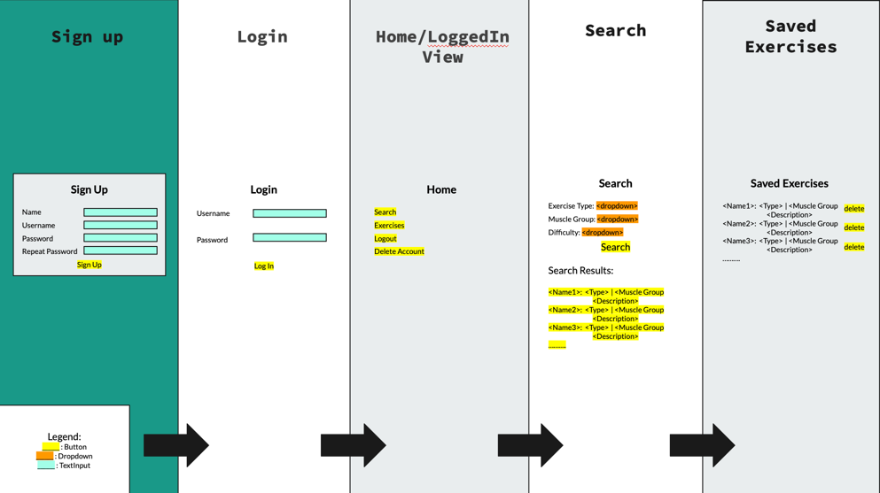

# MyWorkoutApp
# Domain Description:
Our team will develop a fitness app for users to search and  save workouts. Users sign up and log in to access their workouts.

# Software Specification:
- User signup and login.
- Access to a workout database via the "API Ninjas."
- Access to previously saved workouts.
- Filtering workouts by type, difficulty, and muscles.
- Delete user
- User logout.

# User Stories:
- Kayla, a fitness beginner, searches suitable workouts.
- Nicholas sets up his fitness profile.
- Tom wants to delete his fitness profile.
- Daniel searches and then saves exercises into his profile.
- Julian logs in into his user, looks at his past workouts,and logs out.

# User Cases:
- Sign up
- Log in
- Search 
- Retrieve (search workouts)
- Delete user
- Results (select and save searched workouts)

# Proposed Entities:
- Client: Name, Username(Unique), Password.
- Exercise: Title, Muscle group, Description, Difficulty.

# API:
- https://api-ninjas.com/api/exercises

# Project Blueprint:
- https://docs.google.com/presentation/d/1oGg363olvigj77IwsNAJisb0NmsgHAeBxkNnJOlKSR8/edit?usp=sharing

# Presentation Link:
New:
https://docs.google.com/presentation/d/1pFWa8ZtOIaobjYyr3CXTDaSw1nl-wD772gz_oRMDgZs/edit?usp=sharing

Old:
https://utoronto-my.sharepoint.com/:p:/g/personal/catherinez_zheng_mail_utoronto_ca/Ea0KjF8KufRMhn3bxG3IhdUBFkYrcdZRERVlcATYDzpPkQ

# Presentation Plan:
https://l.instagram.com/?u=https%3A%2F%2Fdocs.google.com%2Fdocument%2Fd%2F1hOJEmvNX53GbCDkRO_b3trraU7u0_BN0D8zkdZJldfo%2Fedit%3Fusp%3Dsharing&e=AT2idGmDYJhC90zqxaJwrh0ns78gcvcQ8GZ3mFGGGSkDj7ngV0nB5FHWSWtDCGsjBCU4pcb9ZU987O7NGQ4v83vUi6zNG2kIIdcOcqWt73XxKSL8eCmyW64Bz574ShokeLjjL7-bKZ5D

# User Interface:

